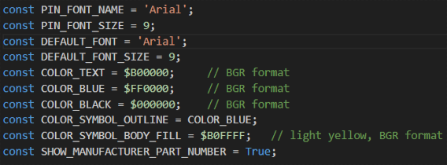
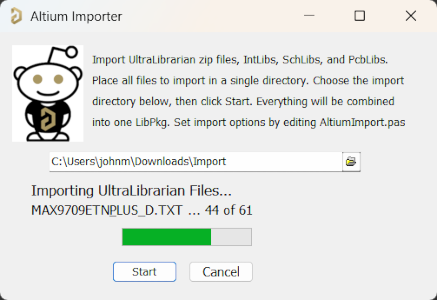
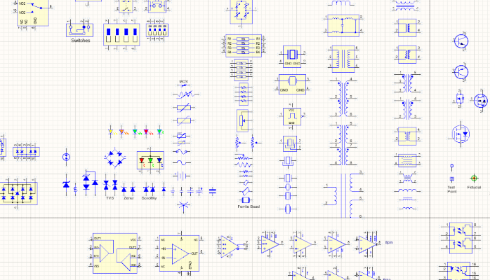
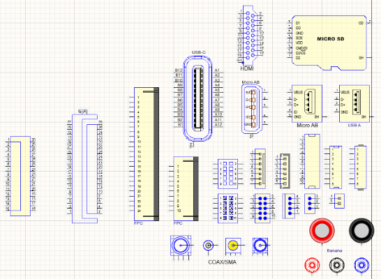
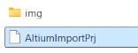
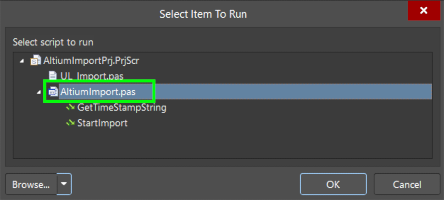
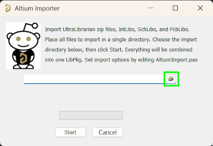
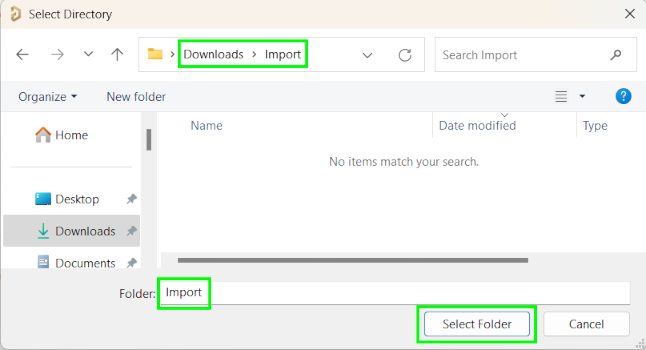

# Altium_Import_Helper
This is the script UltraLibrarian should include with its downloads!! This script imports UltraLibrarian zip files, SnapEda zip files, IntLib files, SchLib files, and PcbLib files. All files are imported and are combined into one LibPkg. This script handles the unzipping of the files, no need to unzip the files first. Also this script imports as many UltraLibrarian files as you have, all at once, and no need to import files individually.

## What This Script Does
Imports EDA files:
  - Unzips UltraLibrarian and SnapEda files
  - Extracts IntLibs to source SchLibs and PcbLibs
  - Imports UltraLibrarian text files
  - Imports SchLibs and PcbLibs
  - places source zip files in Archive dir
  - Improves aspects of the symbols and footprints as described below

### Processes Symbols in SchLib:
  - sets the pin font and size to constants defined in:  PIN_FONT_NAME, PIN_FONT_SIZE
  - sets active low pins so an overbar is in schematic symbol on pin name
  - filters symbol parameters, deletes many unecessary params which are included in symbols
  - sets symbol body to color defined in constant COLOR_SYMBOL_BODY_FILL
  - sets symbol body outline to color defined in constant COLOR_SYMBOL_OUTLINE
  - sets all text label objects to constant: DEFAULT_FONT
  - changes all lines in symbol to color blue
  - moves component so pin1 is at the origin, including for multipart sch symbols
  - fixes UltraLib footprint previews
  - makes MFR Part # visible, at bottom left of symbol body, including for multipart sch symbols
  - deletes default schematic symbol Component1
  - includes a Graphics_Symbol which has many graphics shapes to use in your imported symbols

### Processes Footprints in PcbLib:
  - deletes default footprint PcbComponent1
  - changes silkscreen pin 1 indicator of * to filled circle (Ultralibrarian uses asterisk as pin 1 indicator)
  - changes Mechanical Layer13 pin 1 indicator of '*' to filled circle (Ultralibrarian uses asterisk as pin 1 indicator)
  - changes linewidth of Mechanical13 Layer from 1 mil to 2mil
  - automatically maps STEP files for SnapEDA footprints'

### Awesome Things This Script Does (which UltraLibrarian provided script doesnt do)
  - Gives you control of how schematic symbols will be imported, control symbol fonts, text size, and symbol colors. See the definitions you can adjust at the top of AltiumImport.pas
         
  - Import any number of files all at the same time! No need to import symbols one at a time
     
         
  - Automatically sets active low signals to have overbar
      
    even for complex pin names
      
  - automatically places schematic symbol pin 1 at origin (even for multipart symbols, all parts have top left pin at origin)
      
  - Adds the Manufacturer Part Number as text to the bottom of the symbol
      
  - Includes a schematic symbol with graphics objects you can copy into your imported symbols
      
      
      

## How to Use
For detailed instructions, read [How_To_Install_and_Use_Import_Helper.pdf](./How_To_Install_and_Use_Import_Helper.pdf) , which is included in repo. It makes importing EDA files extremely easy. Just throw all the files you want to import into a single directory. The pdf gives instructions on how to install the script into the Altium GUI.
1. Create a directory to place all the zip files/EDA files/SchLib files in. For instance create a directory 'Import' in your Downloads directory, and place all the files to import inside the 'Import' dir.
         
2. Run the script inside Altium. You can either install the script as part of the GUI (instructions in How_To_Install_and_Use_Import_Helper.pdf) or run in standalone mode. To run in standalone mode without installing, do as below 
 In Altium select File -> Run Script 
   
click Browse->From File       
select AltiumImportPrj       
select AltiumImport.pas      
3. The script starts, click the folder icon    
4. Select the 'Import' folder you created where all the zip files are placed. Note: you will not see any files in this window, only directories.   
5. Click start.   
6. The GUI will report progress as it imports the files    
7. A message displays how many symbols and footprints were imported    
8. The SchLib and PcbLib are open with all imported symbols and footprints    

## Is This Script Useful For You? Want to Donate?
Here's some crypto addresses you can donate to: 
Cardano: addr1qx69ujtyr4jhvfy0wxgkm2x4u3q3sq3qk2v3y4rulqq7qh0jmj7drfc0z6q99u0hyfhvrkxhxtyfg4vzcx56nwfqq3js6qkgnf  
[Meld:](https://www.meld.com/) 0x4D5b8e2e331F5021A5bf8a22e7De10efF596E061  
Or my new favorite memecoin, [RawDog:](https://rawdogpumps.com/) 0x4D5b8e2e331F5021A5bf8a22e7De10efF596E061  

